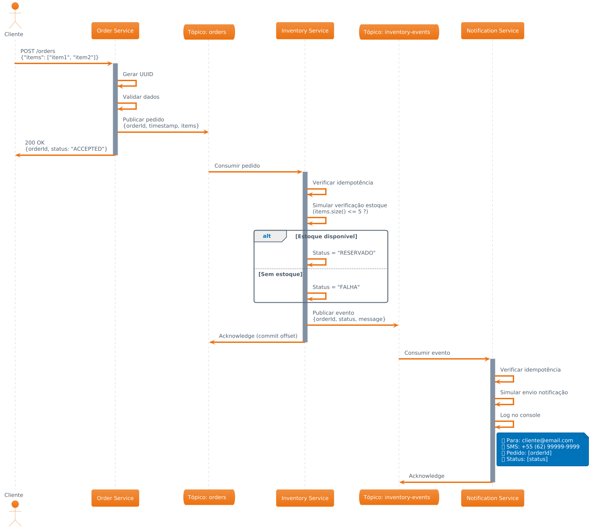
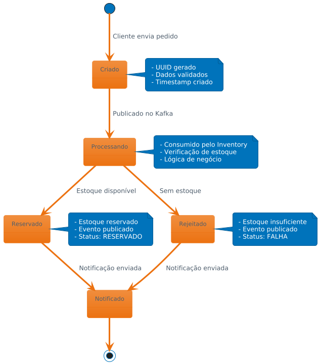
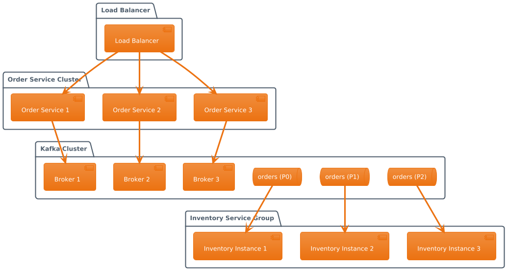
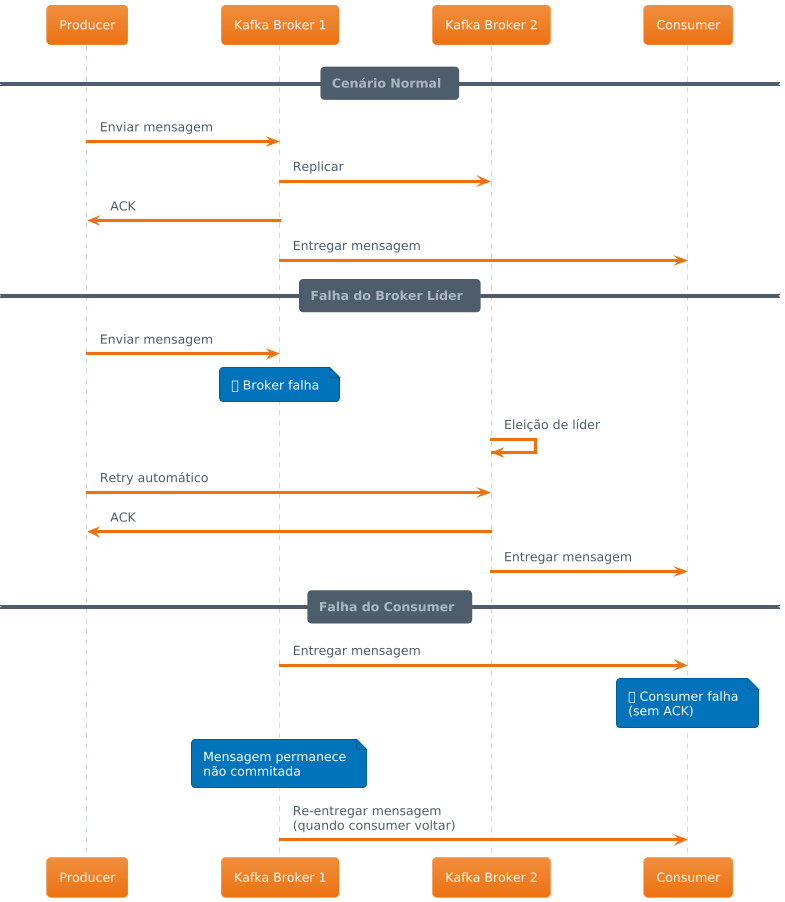
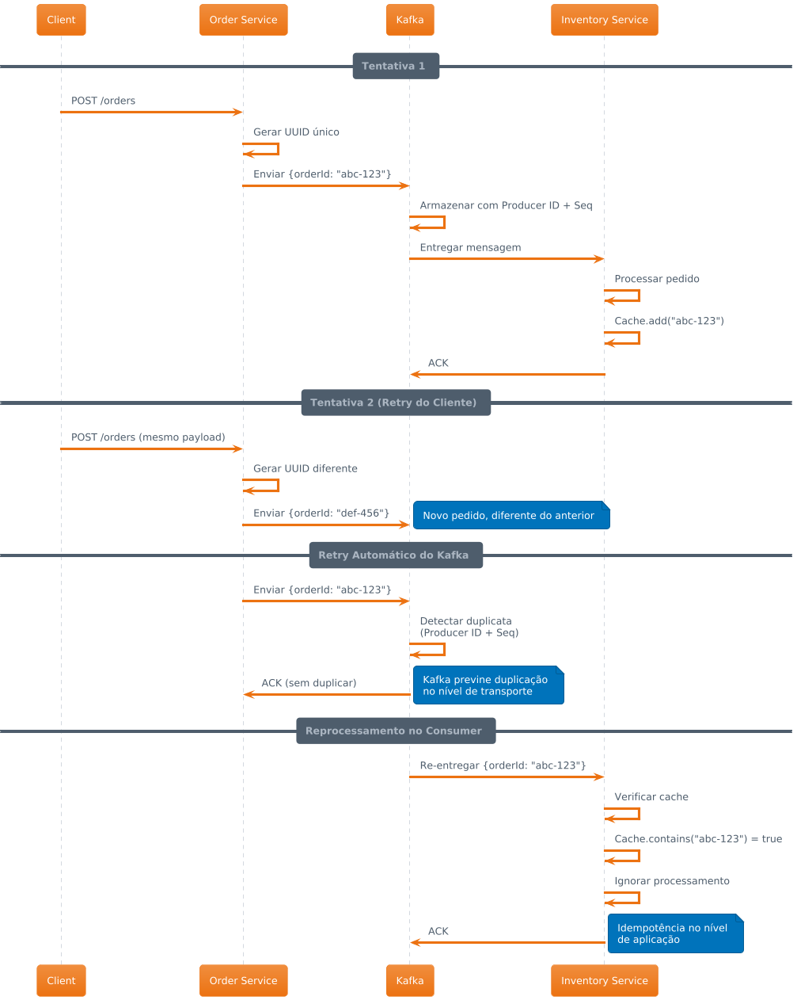
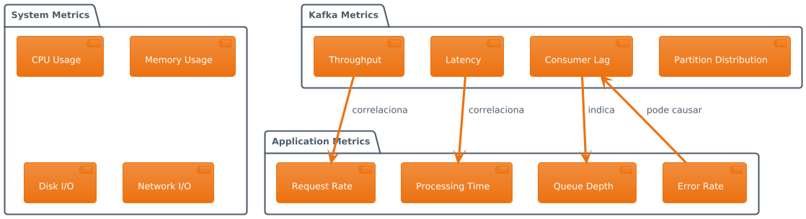

# Sistema de Mensageria Kafka - E-commerce

## 📋 Índice

1. [Visão Geral](#visão-geral)
2. [Arquitetura do Sistema](#arquitetura-do-sistema)
3. [Componentes](#componentes)
4. [Fluxo de Dados](#fluxo-de-dados)
5. [Configuração e Execução](#configuração-e-execução)
6. [Testes](#testes)
7. [Requisitos Não-Funcionais](#requisitos-não-funcionais)
8. [Monitoramento](#monitoramento)
9. [Considerações de Produção](#considerações-de-produção)

## 🎯 Visão Geral

Este projeto implementa uma plataforma de comércio eletrônico distribuída utilizando **Apache Kafka** como backbone de mensageria. O sistema é composto por três microsserviços desenvolvidos em **Java 17** com **Spring Boot 3.1.0**, demonstrando conceitos fundamentais de sistemas distribuídos como:

- **Event-Driven Architecture (EDA)**
- **Padrões de Mensageria Assíncrona**
- **Processamento de Eventos em Tempo Real**
- **Resiliência e Tolerância a Falhas**
- **Escalabilidade Horizontal**

### 🏗️ Cenário de Negócio

O sistema simula um fluxo completo de processamento de pedidos:

1. **Criação de Pedidos**: Cliente cria pedidos através de API REST
2. **Verificação de Estoque**: Sistema verifica disponibilidade automaticamente
3. **Notificação**: Cliente recebe notificações sobre o status do pedido

## 🔧 Arquitetura do Sistema

### Diagrama de Arquitetura Geral


### Diagrama de Componentes Detalhado


## 🧩 Componentes

### 1. Order Service (Produtor)

**Responsabilidades:**
- Receber pedidos via API REST
- Validar dados de entrada
- Gerar UUID único para cada pedido
- Publicar eventos no tópico `orders`

**Endpoints:**
- `POST /orders` - Criação de novos pedidos

**Configurações Kafka:**
- `acks=all` - Máxima durabilidade
- `retries=3` - Tentativas de reenvio
- `enable.idempotence=true` - Garantia de idempotência
- `max.in.flight.requests.per.connection=1` - Ordem das mensagens

### 2. Inventory Service (Consumidor + Produtor)

**Responsabilidades:**
- Consumir pedidos do tópico `orders`
- Simular verificação de estoque
- Publicar resultado no tópico `inventory-events`
- Implementar idempotência local

**Lógica de Negócio:**
- ✅ **Sucesso**: Pedidos com ≤ 5 itens
- ❌ **Falha**: Pedidos com > 5 itens

**Configurações Especiais:**
- Commit manual de offsets
- Cache local para idempotência
- Configuração de retry automático

### 3. Notification Service (Consumidor)

**Responsabilidades:**
- Consumir eventos do tópico `inventory-events`
- Simular envio de notificações (email/SMS)
- Registrar atividades no console
- Controle de duplicação de notificações

## 📊 Fluxo de Dados

### Sequência de Processamento Completa



### Estados e Transições



## ⚙️ Configuração e Execução

### Pré-requisitos

```bash
# Verificar versões
java -version    # Java 17+
mvn -version     # Maven 3.6+
docker --version # Docker 20+
docker-compose --version # Docker Compose 2+
```

### 1. Iniciando a Infraestrutura

```bash
# Subir Kafka e Zookeeper
docker-compose up -d

# Verificar status dos containers
docker-compose ps

# Logs dos containers (opcional)
docker-compose logs -f kafka
```

### 2. Criação Manual de Tópicos (Opcional)

```bash
# Criar tópico 'orders'
docker exec kafka kafka-topics --create \
  --topic orders \
  --bootstrap-server localhost:9092 \
  --partitions 3 \
  --replication-factor 1

# Criar tópico 'inventory-events'  
docker exec kafka kafka-topics --create \
  --topic inventory-events \
  --bootstrap-server localhost:9092 \
  --partitions 3 \
  --replication-factor 1

# Listar tópicos
docker exec kafka kafka-topics --list \
  --bootstrap-server localhost:9092
```

### 3. Executando os Microsserviços

```bash
# Terminal 1 - Order Service
cd order-service
mvn clean spring-boot:run

# Terminal 2 - Inventory Service
cd inventory-service  
mvn clean spring-boot:run

# Terminal 3 - Notification Service
cd notification-service
mvn clean spring-boot:run
```

### Estrutura de Portas

| Serviço | Porta | Descrição |
|---------|-------|-----------|
| Zookeeper | 2181 | Coordenação Kafka |
| Kafka Broker | 9092 | Broker principal |
| Order Service | 8081 | API REST |
| Inventory Service | 8082 | Consumidor/Produtor |
| Notification Service | 8083 | Consumidor final |

## 🧪 Testes

### Cenários de Teste

#### 1. Teste de Sucesso (≤ 5 itens)

```bash
curl -X POST http://localhost:8081/orders \
  -H "Content-Type: application/json" \
  -d '{
    "items": ["notebook", "mouse", "teclado"]
  }'
```

**Resposta Esperada:**
```json
{
  "message": "Pedido recebido com sucesso!",
  "orderId": "123e4567-e89b-12d3-a456-426614174000",
  "status": "ACCEPTED",
  "itemCount": 3
}
```

#### 2. Teste de Falha de Estoque (> 5 itens)

```bash
curl -X POST http://localhost:8081/orders \
  -H "Content-Type: application/json" \
  -d '{
    "items": ["item1", "item2", "item3", "item4", "item5", "item6", "item7"]
  }'
```

#### 3. Teste de Validação (Lista vazia)

```bash
curl -X POST http://localhost:8081/orders \
  -H "Content-Type: application/json" \
  -d '{
    "items": []
  }'
```

### Scripts de Teste Automatizado

```bash
#!/bin/bash
# test-scenarios.sh

echo "🧪 Iniciando testes do sistema..."

# Teste 1: Pedido válido
echo "📝 Teste 1: Pedido com 3 itens (sucesso esperado)"
curl -X POST http://localhost:8081/orders \
  -H "Content-Type: application/json" \
  -d '{"items": ["item1", "item2", "item3"]}' \
  -w "\nStatus: %{http_code}\n\n"

sleep 3

# Teste 2: Pedido inválido por quantidade
echo "📝 Teste 2: Pedido com 7 itens (falha esperada)"
curl -X POST http://localhost:8081/orders \
  -H "Content-Type: application/json" \
  -d '{"items": ["item1", "item2", "item3", "item4", "item5", "item6", "item7"]}' \
  -w "\nStatus: %{http_code}\n\n"

sleep 3

# Teste 3: Validação
echo "📝 Teste 3: Lista vazia (erro de validação)"
curl -X POST http://localhost:8081/orders \
  -H "Content-Type: application/json" \
  -d '{"items": []}' \
  -w "\nStatus: %{http_code}\n\n"

echo "✅ Testes concluídos!"
```

### Logs Esperados

**Order Service:**
```
🛒 Order-Service: Criando pedido abc-123 com 3 itens
✅ Order-Service: Pedido abc-123 publicado com sucesso no tópico orders
```

**Inventory Service:**
```
📦 Inventory-Service: Processando pedido abc-123 com 3 itens
✅ Inventory-Service: Pedido abc-123 processado - Status: RESERVADO
```

**Notification Service:**
```
📨 Notification-Service: Recebido evento para pedido abc-123
📢 ========== NOTIFICAÇÃO ==========
📧 Para: cliente@email.com
📱 SMS: +55 (62) 99999-9999
🔢 Pedido: abc-123
📊 Status: RESERVADO
📝 Mensagem: Estoque reservado com sucesso
📦 Quantidade de itens: 3
⏰ Timestamp: 2025-06-25T10:30:00Z
=====================================
✅ Notification-Service: Notificação enviada com sucesso para pedido abc-123
```

## 🏗️ Requisitos Não-Funcionais

### 1. Escalabilidade

#### Escalabilidade Horizontal



**Estratégias de Escalabilidade:**

- **Particionamento**: Tópicos divididos em múltiplas partições
- **Grupos de Consumidores**: Instâncias distribuem carga automaticamente
- **Balanceamento**: Kafka redistribui partições quando consumidores entram/saem
- **Brokers Adicionais**: Expansão horizontal do cluster Kafka

#### Configurações para Escala

```yaml
# application-prod.yml
spring:
  kafka:
    consumer:
      max-poll-records: 100
      fetch-min-size: 1024
      fetch-max-wait: 500ms
    producer:
      batch-size: 16384
      linger-ms: 5
      buffer-memory: 33554432
```

### 2. Tolerância a Falhas

#### Cenários de Falha e Recuperação



**Mecanismos de Tolerância:**

1. **Replicação de Dados**
   - Fator de replicação configurável
   - Eleição automática de líderes
   - Sincronização de réplicas

2. **Retry e Recuperação**
   - Retry automático no produtor
   - Reprocessamento de mensagens não commitadas
   - Dead Letter Queue (configurável)

3. **Health Checks**
   - Monitoramento de conectividade
   - Detecção de brokers inativos
   - Failover automático

### 3. Idempotência

#### Implementação Multicamada



**Implementação por Camada:**

1. **Nível Kafka (Transporte)**
   ```java
   // Producer idempotente
   props.put(ProducerConfig.ENABLE_IDEMPOTENCE_CONFIG, true);
   props.put(ProducerConfig.ACKS_CONFIG, "all");
   props.put(ProducerConfig.MAX_IN_FLIGHT_REQUESTS_PER_CONNECTION, 1);
   ```

2. **Nível Aplicação (Negócio)**
   ```java
   // Cache de pedidos processados
   private final Set<String> processedOrders = ConcurrentHashMap.newKeySet();
   
   if (processedOrders.contains(orderId)) {
       log.warn("Pedido {} já processado", orderId);
       return; // Idempotência
   }
   ```

3. **Nível Banco (Persistência)**
   ```sql
   -- Constraint de unicidade
   ALTER TABLE orders ADD CONSTRAINT uk_order_id UNIQUE (order_id);
   ```

## 📊 Monitoramento

### Métricas Importantes



### Dashboard de Monitoramento

**Métricas Kafka:**
- `kafka.server:type=BrokerTopicMetrics,name=MessagesInPerSec`
- `kafka.server:type=BrokerTopicMetrics,name=BytesInPerSec`
- `kafka.consumer:type=consumer-fetch-manager-metrics,client-id=*`

**Métricas Spring Boot:**
- `http.server.requests` - Latência e throughput HTTP
- `kafka.producer.record-send-rate` - Taxa de envio
- `kafka.consumer.records-consumed-rate` - Taxa de consumo

**Alertas Recomendados:**
- Consumer lag > 1000 mensagens
- Taxa de erro > 5%
- Latência P95 > 500ms
- Disk usage > 80%

## 🚀 Considerações de Produção

### Configurações de Produção

#### Kafka Cluster

```yaml
# docker-compose-prod.yml
version: '3.8'
services:
  kafka-1:
    image: confluentinc/cp-kafka:7.2.1
    environment:
      KAFKA_BROKER_ID: 1
      KAFKA_ZOOKEEPER_CONNECT: zk-1:2181,zk-2:2181,zk-3:2181
      KAFKA_ADVERTISED_LISTENERS: PLAINTEXT://kafka-1:9092
      KAFKA_OFFSETS_TOPIC_REPLICATION_FACTOR: 3
      KAFKA_DEFAULT_REPLICATION_FACTOR: 3
      KAFKA_MIN_INSYNC_REPLICAS: 2
      KAFKA_LOG_RETENTION_HOURS: 168
      KAFKA_LOG_SEGMENT_BYTES: 1073741824
    volumes:
      - kafka-1-data:/var/lib/kafka/data
      
  kafka-2:
    # Similar configuration...
    
  kafka-3:
    # Similar configuration...

volumes:
  kafka-1-data:
  kafka-2-data:
  kafka-3-data:
```

#### Aplicação Spring Boot

```yaml
# application-prod.yml
spring:
  kafka:
    bootstrap-servers: kafka-1:9092,kafka-2:9092,kafka-3:9092
    producer:
      acks: all
      retries: 2147483647
      enable-idempotence: true
      max-in-flight-requests-per-connection: 5
      compression-type: snappy
      batch-size: 65536
      linger-ms: 20
    consumer:
      auto-offset-reset: earliest
      enable-auto-commit: false
      max-poll-records: 500
      session-timeout-ms: 30000
      heartbeat-interval-ms: 10000

management:
  endpoints:
    web:
      exposure:
        include: health,info,metrics,prometheus
  metrics:
    export:
      prometheus:
        enabled: true

logging:
  level:
    org.apache.kafka: WARN
    org.springframework.kafka: INFO
    com.example: INFO
```

### Segurança

#### Autenticação e Autorização

```properties
# Kafka SASL/SSL
security.protocol=SASL_SSL
sasl.mechanism=PLAIN
sasl.jaas.config=org.apache.kafka.common.security.plain.PlainLoginModule required \
  username="user" password="password";

# SSL
ssl.truststore.location=/path/to/truststore.jks
ssl.truststore.password=password
ssl.keystore.location=/path/to/keystore.jks
ssl.keystore.password=password
```

### Backup e Recuperação

#### Estratégia de Backup

1. **Snapshots de Tópicos**
   ```bash
   # Mirror Maker para backup cross-cluster
   kafka-mirror-maker --consumer.config consumer.properties \
     --producer.config producer.properties \
     --whitelist "orders,inventory-events"
   ```

2. **Backup de Configurações**
   ```bash
   # Export de configurações de tópicos
   kafka-configs --bootstrap-server localhost:9092 \
     --describe --entity-type topics \
     --entity-name orders > topic-configs-backup.txt
   ```

### Performance Tuning

#### Otimizações Kafka

```properties
# Broker optimizations
num.network.threads=8
num.io.threads=16
socket.send.buffer.bytes=102400
socket.receive.buffer.bytes=102400
socket.request.max.bytes=104857600

# Log optimizations  
log.flush.interval.messages=10000
log.flush.interval.ms=1000
log.segment.bytes=1073741824
log.retention.check.interval.ms=300000
```

#### Otimizações JVM

```bash
# JVM flags para produção
-Xms4g -Xmx4g
-XX:+UseG1GC
-XX:MaxGCPauseMillis=20
-XX:InitiatingHeapOccupancyPercent=35
-XX:+ExplicitGCInvokesConcurrent
-Djava.awt.headless=true
```

## 👥 Equipe de Desenvolvimento

- **Carlos Antonio** - Arquitetura e Implementação
- **Thiago Vicente** - Configuração e Testes

## 📚 Referências

- [Apache Kafka Documentation](https://kafka.apache.org/documentation/)
- [Spring Kafka Reference](https://docs.spring.io/spring-kafka/docs/current/reference/html/)
- [Confluent Platform Documentation](https://docs.confluent.io/)
- [Kafka: The Definitive Guide](https://www.confluent.io/resources/kafka-the-definitive-guide/)

---

**Versão:** 1.0  
**Data:** Junho 2025  
**Status:** ✅ Produção Ready
